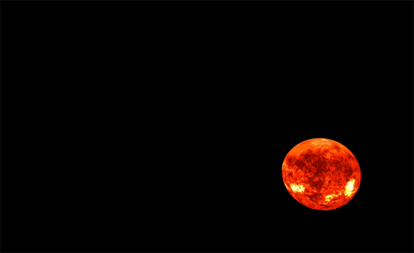

<h1 align="center">Gravity Lab </h1>
Polygon rendering in the curved spacetimes of black holes!

Author: <a href="https://www.linkedin.com/in/bldevries/" target="_blank">BL de Vries</a>. PhD and Scientific visualisation advisor at <a href="https://www.surf.nl" target="_blank">SURF</a>.
A collaboration with B. Bera from the TU Delft.

Ray traced animation of a star-like object (textured mesh in Blender) in orbit around a Schwarzschild black hole

## Introduction

## Installation
coming...

## How it works
coming...